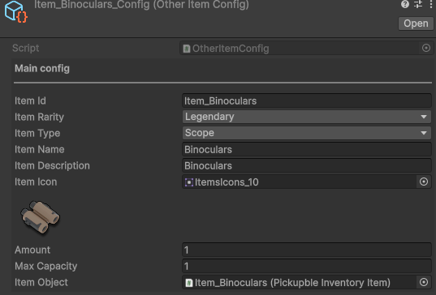
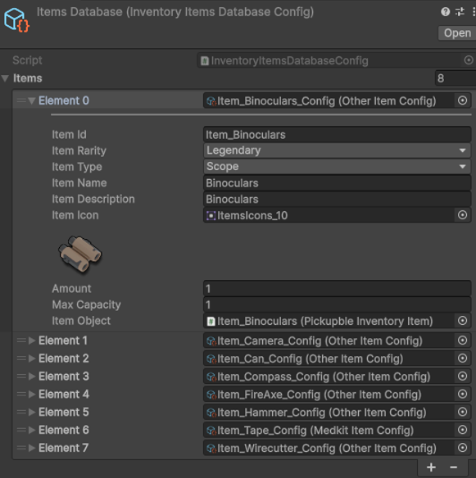

# InventorySystem

🎮 Controls

W / A / S / D - Move

I - Open Inventory

E - Pick Up Item

LMB Double Click - Use Item

🧩 General Information
The project does not use DI or reactive libraries.
The UI logic is implemented using the MVC pattern.
If needed, DI or reactive extensions can be easily integrated.

📦 System Features
Supports multiple inventory grids (e.g., Player, NPC, Chest).
Simple saving system using PlayerPrefs - data is stored as a string,
which makes it easy to switch to JSON or any other storage format.

⚙️ Adding New Items
Create a ScriptableObject of the required type.
Add it to the ItemsDatabase.
Done - the item will be available in the system.

Item Config - 

Item Database - 

